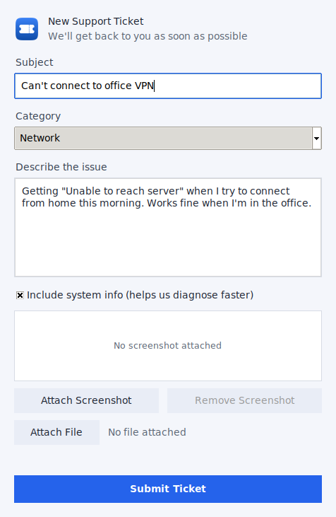
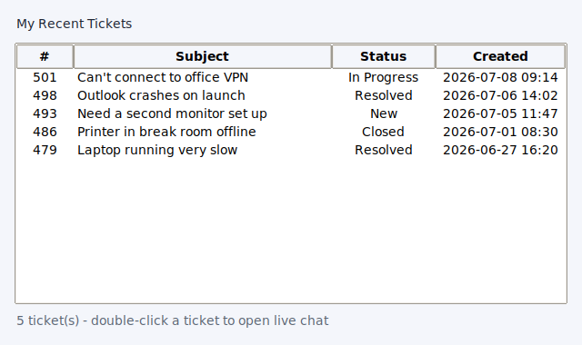

# ITPanel Pro

A lightweight tray/menu bar app that lets end users submit an ITFlow support
ticket — with an optional screenshot or file attachment — in a few clicks,
with no portal login. Intended for mass deployment via RMM, with all
connection settings (ITFlow URL, API key, client ID, etc.) configured at
install time so the end user never sees credentials.

## Screenshots

<table>
<tr>
<td align="center" width="34%"><b>New Ticket</b></td>
<td align="center" width="33%"><b>My Recent Tickets</b></td>
<td align="center" width="33%"><b>Live Chat</b></td>
</tr>
<tr>
<td></td>
<td></td>
<td></td>
</tr>
</table>

## Features

- New Ticket window with subject, description, screenshot, and file
  attachment
- Auto-attaches system info (hostname, OS, user, local IP) to help
  diagnose issues faster
- Auto-links the ticket to the matching asset in ITFlow by hostname
- Ticket category dropdown (when configured in ITFlow)
- Offline queue — tickets submitted while offline are sent automatically
  once connectivity returns
- "My Recent Tickets" tray menu view
- "Open Client Portal" button to open the ITFlow client portal in the browser
- Desktop notifications when a submitted ticket's status changes
- Silent auto-update check against GitHub releases, with a one-click
  download-and-install update on Windows
- Per-MSP branding (accent color + logo)
- "Quick Tools" troubleshooting menu: public IP, ping google.com, list
  printers, restart print spooler/CUPS, open network adapter settings

## Platforms

| Platform | Status | Docs |
|----------|--------|------|
| Windows  | Available | [Windows/README.md](Windows/README.md) |
| macOS    | Available | [macOS/README.md](macOS/README.md) |
| Linux    | Available | [Linux/README.md](Linux/README.md) |

## Requirements

Requires **[ITFlow MSP — From TheTractorHacker](https://github.com/TheTractorHacker/itflow) v2.11.32 or later** —
this is the version that added multipart/form-data attachment support to
`POST /api/v1/tickets` (used to submit the optional screenshot alongside the
ticket).

## Repo layout

- `common/` — shared tray app UI/logic (ttk ticket window, config loading,
  tray icon wiring) used by every platform's `tray_app.py`
- `Windows/` — tray app entry point, PyInstaller spec, branded icon, and
  TacticalRMM deploy script
- `installer/` — Inno Setup installer that prompts for per-install
  configuration and writes `config.json`
- `macOS/` — menu bar app entry point, PyInstaller spec/bundle, LaunchAgent,
  and `install.sh`
- `Linux/` — tray app entry point, PyInstaller spec, XDG autostart entry,
  and `install.sh`
- `.github/workflows/` — CI that builds all three platforms and attaches
  the binaries/installers to GitHub releases
